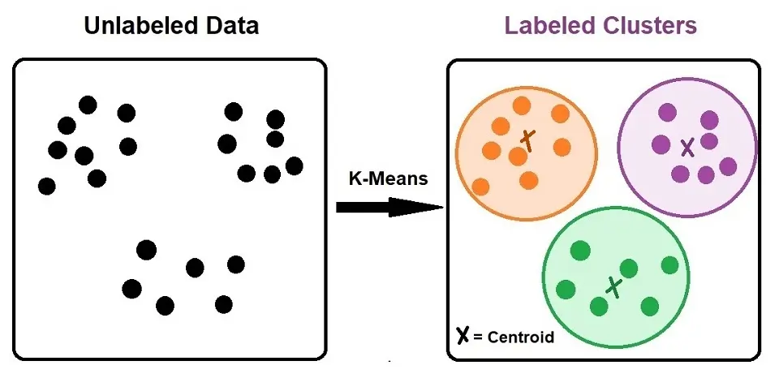
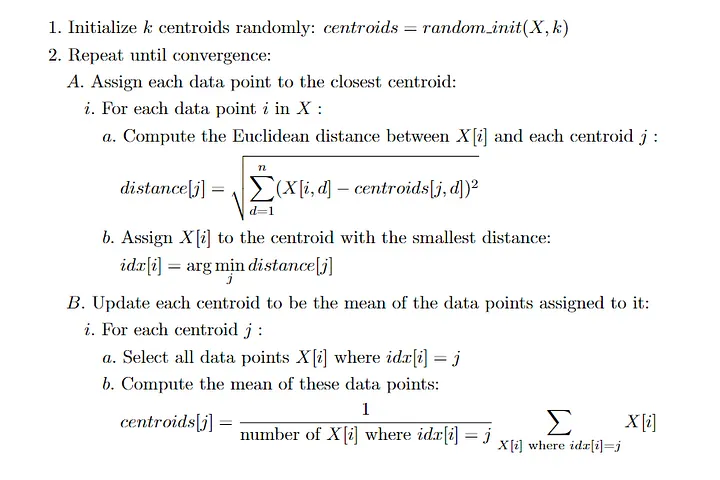

# K-Means Clutering - unsupervised learning

- [K-Means Clutering - unsupervised learning](#k-means-clutering---unsupervised-learning)
  - [K-Means Clustering](#k-means-clustering)
  - [What is clustering and K-means clustering](#what-is-clustering-and-k-means-clustering)
  - [How it Works - K mean cluster](#how-it-works---k-mean-cluster)
  - [Objectivees of k-means clustering](#objectivees-of-k-means-clustering)
  - [Examples of k-means clustering](#examples-of-k-means-clustering)
  - [Practical Implementation](#practical-implementation)
    - [1. Building from scratch](#1-building-from-scratch)
    - [2. uing the scikit library](#2-uing-the-scikit-library)

---

## K-Means Clustering
This is a popular unsupervised machine learning algorithm used for partitioning a dataset into a pre-defined number of clusters. 

>The goal is to group similar data points together and discover underlying patterns or structures within the data.

* points within a cluster should be similar to each other
* minimize the distance of the points in a cluster with their centroid 
*  centroid-based algorithm or a distance-based algorithm
---

## What is clustering and K-means clustering
Clustering is the process of dividing the entire data into groups (also known as clusters) based on the patterns in the data.

We have two types 
* **heirarchical clustering** (creates a hierarchical tree-like structure to represent the relationships between the clusters)
* **k-means clustering** (divides data into a predefined number of clusters,)

----

## How it Works - K mean cluster
1. Choose K (number of clusters).- 
2. Initialize K centroids.
3. Assign each point to the nearest centroid.
4. Recalculate centroids.
5. Repeat until stable.

---

## Objectivees of k-means clustering

The main objective of k-means clustering is to partition your data into a specific number (k) of groups.so objectives are 
* Grouping similar data points
* Minimizing within-cluster distance:
* Maximizing between-cluster distance

---

## Examples of k-means clustering
- segmenting the customers into differnet groups like high income,avaerge income, low income.
-Group products based on their co-occurrence in customer transactions.
-Identify unusual patterns or outliers in data, such as network intrusions or credit card fraud.
Group products based on user preferences and behavior

---
## Practical Implementation 
We can use two methods 
1. Building from Scratch 
2. Using the scikit learn library

### 1. Building from scratch

1. load the data
2. Initialize the number of cluster and centroids randomly
3. Assign each data point to the closest centroid:
4. Update each centroid to be the mean of the data points assigned to it
5. Repeat step 3 & 4
6. Plot the final cluster

>For complete code checkout [Python File](/k_measn_from_scratch.py)

### 2. uing the scikit library
1. load the dataset
2. apply k-means
3. visualize
   

>For complete code checkout [Python File](/k_means_using_scikit.py)